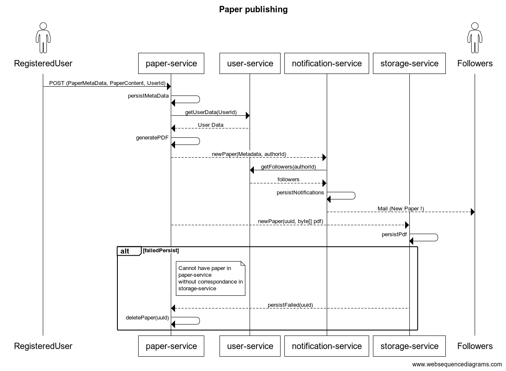

# Sapioza

## Objectifs du système :

*Nous nous proposons de réaliser une application ayant pour objectif la centralisation des articles scientifiques, tous domaines confondus.* 

Cette application permet de poster des articles et de les consulter. 
Les pdfs sont générés par l'application en utilisant la bibliothèque Apache Pdfbox.

L'application a pour ambition de ressembler à un réseau social de partage de connaissances 
scientifiques; des systèmes d'abonnement, de notification, 
de 'like' et de commentaires des lecteurs sont mis en place dans cet objectif.

Les usagers abonnés à un auteur reçoivent une notification lors de la parution d'un article
écrit par celui-ci.
Le système de notification est composé de deux parties, une interne à l'application, 
et un envoi de mails automatique aux abonnés.

La sécurité des données est prise en compte, pour réaliser des opérations sensibles 
(suppression d'article par exemple), des processus sont mis en place pour éviter les 
usurpations d'identités.

Aussi, des mesures sont mises en place pour éviter des incohérence dans les données ;
système de rollback inter-services en cas d'échec d'enregistrement par exemple

L'application dispose enfin d'un outil de recherche proposant plusieurs filtres de recherche 
(année de publication, titre, abstract, auteur, domaine de recherche...).

### Microservices et descriptions :

- Paper Service : Création, modification, suppression, accès (unitaire et filtrage) aux articles 
; systèmes sociaux (likes et commentaires) et génération des pdfs 
- Storage Service : Stockage efficace des pdfs générés, modification et mise à disposition de ceux-
ci
- User Service : Gestion des utilisateurs de l'application : création de compte, connexion, abonnements,
vérification d'identité, mise à disposition des informations des utilisateurs (interne et externe)
- Notification Service : Système d'enregistrement et de mise à disposition des notifications liées à 
la publication d'un article ; envoi de mails

### Use Cases :

#### Utilisateur :

- Créer un article
- Supprimer un article écrit par soi-même
- Modifier //
- Créer un compte, se connecter
- Consulter un article
- Consulter le profil d'un autre utilisateur
- Rechercher un article (à partir de sa référence unique dans Sapioza)
- Effectuer une recherche filtrée
- S'abonner à un chercheur
- Liker/Disliker un article
- Commenter un article
- Consulter les articles de ses abonnements
- Consulter ses notifications

## Diagramme de Séquence :

### Création d'un article :

